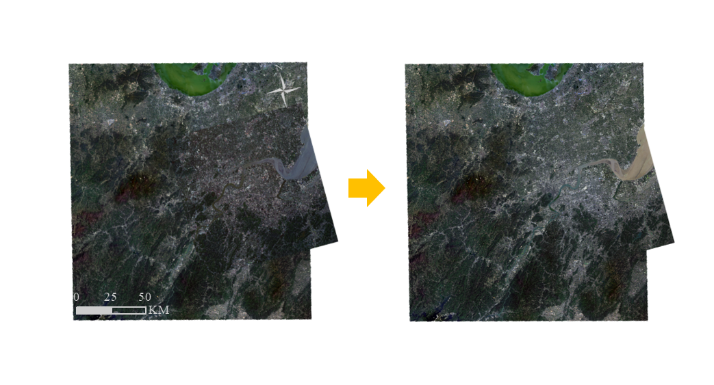

# ColorConsistencyProgramExample

## Introduction

This project is developed for optimizing the color consistency between images.We establish a color mapping model between overlapping areas of images based on convolutional neural networks, and apply this color mapping model to the entire image of the target image to achieve color consistency.

Here is an example for demonstration below:

